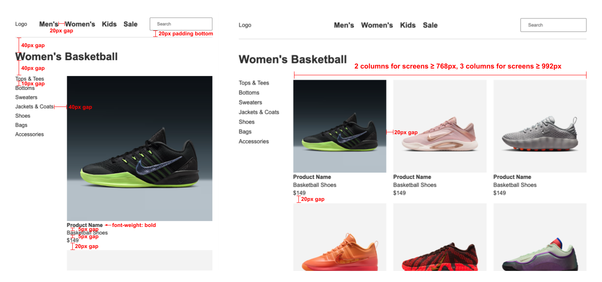

# Assignment 3.2 - Flexbox and Grid

**Table of Contents**
- [Reminders](#reminders)
- [Setup](#setup)
- [Short Response Questions](#short-response-questions)
- [Build a Product Page Layout](#build-a-product-page-layout)
  - [Design Specifications](#design-specifications)
  - [Methodical Debugging \& Development Tips](#methodical-debugging--development-tips)
- [CSS Cheatsheet](#css-cheatsheet)
  - [Flexbox (Container Properties)](#flexbox-container-properties)
  - [Flexbox (Item Properties)](#flexbox-item-properties)
  - [Grid](#grid)
  - [Media Queries](#media-queries)
- [Part 1: HTML Structure](#part-1-html-structure)
- [Part 2: Flexbox Layout](#part-2-flexbox-layout)
- [Part 3: Grid Layout](#part-3-grid-layout)
- [Part 4: Media Queries (Responsive Design)](#part-4-media-queries-responsive-design)
- [Bonus Challenges](#bonus-challenges)

## Reminders

**<details><summary>Asking ChatGPT for Help</summary>**

If you're stuck, you may use ChatGPT to clarify the assignment — but not to solve it for you. To do this, copy the meta-prompt below into ChatGPT along with the assignment question.

> You are acting as a tutor. Your job is to explain what this coding question is asking, clarify confusing wording, and highlight the relevant concepts students need to know — but do not provide the full solution or code that directly answers the question. Instead, focus on rephrasing the problem in simpler terms, identifying what's being tested, and suggesting what steps or thought processes might help. Ask guiding questions to ensure the student is thinking critically. Do not write the final function, algorithm, or code implementation.

Be mindful of your AI usage on assignments. AI can be a great tool to help your learning but it can also be detrimental if you let it do too much of the thinking for you.

</details>

**<details><summary>Be Okay With Being "Provisionally Complete"</summary>**

At Marcy, we will deem an assignment as "complete" if you satisfy the requirements listed below. 

However, we know many of you will feel the urge to hold off on submitting until your assignment feels 100% perfect. That drive for excellence is an asset!

But perfectionism can also get in the way of learning — especially when we need to cover a lot in a short amount of time.

That's why we encourage you to be comfortable with being **"provisionally complete."** This means:

- Submitting your work even if it isn't perfect yet
- Treating submission as a checkpoint, not a finish line
- Committing to return, revise, and improve later

Learning to move forward with provisional completeness will help you make steady progress while still building the habit of continuous improvement.

</details>

## Setup

For guidance on setting up and submitting this assignment, refer to the Marcy lab School Docs How-To guide for [Working with Short Response and Coding Assignments](https://marcylabschool.gitbook.io/marcy-lab-school-docs/how-tos/working-with-assignments#how-to-work-on-assignments).

Starter files have been provided in the `src/` directory:
- `index.html` — Basic structure with header and footer provided
- `style.css` — CSS reset and basic styles provided

**To view your page**: Drag and drop the `index.html` from the file explorer in VS Code directly into your Chrome Browser tab (do not use Safari — their devtools are terrible. Firefox is okay but not preferred).

Here are some useful commands to remember to get started

```sh
git checkout -b draft   # switch to the draft branch before starting

git add -A              # add a changed file to the staging area
git commit -m 'message' # create a commit with the changes
git push                # push the new commit to the remote repo
```

When you are finished, create a pull request and tag your instructor for review.

## Short Response Questions

Short response questions can be found in the `src/short-response.md` file. Write your responses directly in that file. Do not forget to complete this part of the assignment.

## Build a Product Page Layout

Your task is to build a **product page** for the Marcy Sneaker Company using HTML, Flexbox, Grid, and Media Queries. A basic HTML structure with the header and footer has been provided — your job is to build out the main content and add CSS to create the layout.

### Design Specifications

Below are the design specifications showing what your product page should look like on **mobile** (single column) and **larger screens** (multi-column with sidebar).



**Key Layout Features:**
- **Header**: Logo, navigation links, and search bar arranged horizontally with space between
- **Navigation**: Links displayed in a row with consistent spacing
- **Categories Sidebar**: The categories sidebar appears to the left of the product grid
- **Product Grid**: Responsive grid that shows 1 column on mobile, 2 columns on tablets, and 3 columns on desktops

### Methodical Debugging & Development Tips

- Test your page frequently by refreshing the browser (Cmd+Shift+R or Ctrl+Shift+R for hard refresh)
- Use your browser's Developer Tools (right-click > Inspect) to debug CSS issues
- Resize your browser window to test responsive behavior
- If a style isn't working, check for typos and missing semicolons!

## CSS Cheatsheet

Here is a reference of the CSS properties we've learned. **You don't need to memorize these!** Use this as a reference while working.

### Flexbox (Container Properties)

Apply these to the **parent** element with `display: flex`:

| Property          | What It Does                              | Example                          |
| ----------------- | ----------------------------------------- | -------------------------------- |
| `display: flex`   | Makes the element a flex container        | `display: flex;`                 |
| `flex-direction`  | Sets direction: `row` (default), `column` | `flex-direction: column;`        |
| `justify-content` | Spacing along the **main axis**           | `justify-content: space-between` |
| `align-items`     | Alignment along the **cross axis**        | `align-items: center;`           |
| `gap`             | Space **between** flex items              | `gap: 20px;`                     |
| `flex-wrap`       | Allow items to wrap to next line          | `flex-wrap: wrap;`               |

**Common `justify-content` values:** `flex-start`, `flex-end`, `center`, `space-between`, `space-around`, `space-evenly`

**Common `align-items` values:** `flex-start`, `flex-end`, `center`, `stretch` (default)

### Flexbox (Item Properties)

Apply these to **children** of a flex container:

| Property | What It Does                                                    | Example     |
| -------- | --------------------------------------------------------------- | ----------- |
| `flex`   | Controls how much an item grows/shrinks relative to its sibling | `flex: 1;`  |

### Grid

Apply these to the **parent** element with `display: grid`:

| Property                | What It Does                     | Example                             |
| ----------------------- | -------------------------------- | ----------------------------------- |
| `display: grid`         | Makes the element a grid         | `display: grid;`                    |
| `grid-template-columns` | Defines column sizes             | `grid-template-columns: 1fr 1fr;`   |
| `gap`                   | Space between grid items         | `gap: 20px;`                        |

**The `fr` unit** divides available space into fractions. `1fr 1fr 1fr` creates 3 equal columns.

**The `repeat()` function** simplifies repetitive patterns: `repeat(3, 1fr)` = `1fr 1fr 1fr`

### Media Queries

```css
/* Styles for screens 768px and wider */
@media (min-width: 768px) {
  .selector {
    /* styles here */
  }
}
```

**Common Breakpoints:**
- Small devices (landscape phones): `576px`
- Medium devices (tablets): `768px`
- Large devices (desktops): `992px`

## Part 1: HTML Structure

The header and footer have been provided. Your job is to build out the main content area.

**Products Section Structure:**

Inside `<main>`, below the `<h1>`, add the following structure:

- [ ] A `<section>` to contain the sidebar and product grid
  - [ ] Inside the section, use an `<aside>` for the sidebar
    - [ ] Inside the aside, use an unordered list `<ul>` with list items for the categories
  - [ ] Inside the section, next to the sidebar, use another unordered list `<ul>` for the products grid. Each list item will be a "product card" in the in the grid.

**Product Card Structure:**

Inside the product grid, create at least 6 product cards. Each product card should be a list item containing:

- [ ] A `<figure>` with an `` and `<figcaption>` for the product name
- [ ] A `<p>` for the product type (e.g., "Basketball Shoes")
- [ ] A `<p>` for the price (e.g., "$149")

**Notes:**
- Pictures have been provided for you in the `src/img` folder. 
- For the `alt` text, simply use `"product 1"`, `"product 2"`, etc.
- The text content for the product type and price can be the same for all products.

**Tips:**
- Create a single product card and then use copy-paste to create multiple product cards quickly

## Part 2: Flexbox Layout

Use the design spec to guide your layout. The spec shows spacing values and annotations like "gap" that hint at where to use Flexbox.

**Flexbox Requirements:**

- [ ] Use `display: flex` on at least 4 different elements
- [ ] Use `justify-content` to control spacing along the main axis
- [ ] Use `align-items` to control alignment along the cross axis
- [ ] Use `gap` to create consistent spacing between flex items
- [ ] Use `flex-direction: column` where elements should stack vertically
- [ ] Use `flex: 1` to make the picture grid expand to fill available space

## Part 3: Grid Layout

Use CSS Grid to create the product grid layout. The spec shows the grid structure and spacing.

**Grid Requirements:**

- [ ] Use `display: grid` on the products container
- [ ] Use `gap` to create spacing between grid items

## Part 4: Media Queries (Responsive Design)

Make the product grid responsive using media queries. The grid should adapt to different screen sizes.

**Media Query Requirements:**

- [ ] Use `@media (min-width: 768px)` to add a second column on tablets
- [ ] Use `@media (min-width: 992px)` to add a third column on desktops
- [ ] Use `grid-template-columns` with the `fr` unit or `repeat()` function

## Bonus Challenges

If you finish early, try these enhancements:

- [ ] Add a `:hover` effect to the category list items (underline and pointer cursor)
- [ ] Make the `figcaption` bold
- [ ] Add hover effects to the product cards (box shadow, transform scale, etc.)
- [ ] Add a fourth column at an extra-large breakpoint (1200px)
- [ ] Hide the categories sidebar on mobile and show it only on larger screens using `display: none` and media queries
